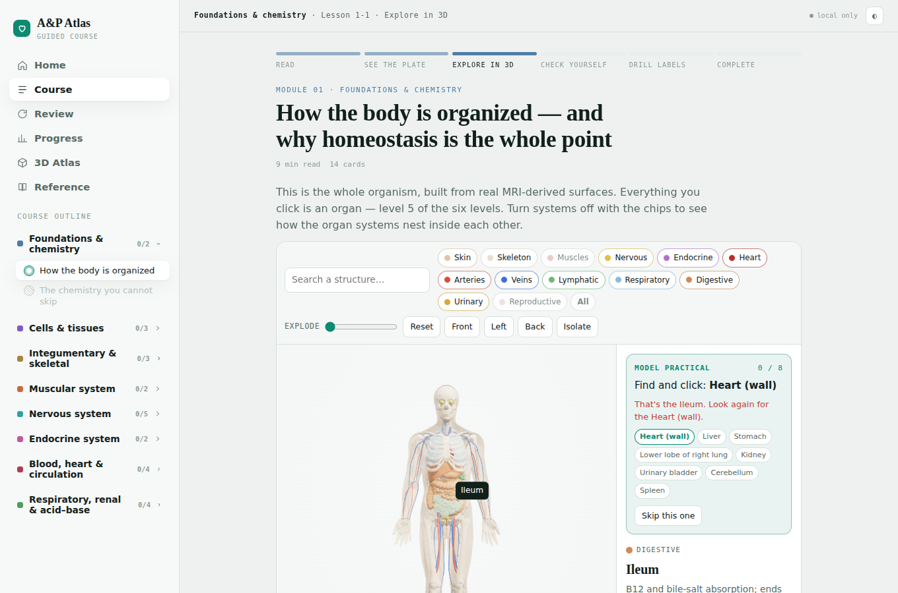
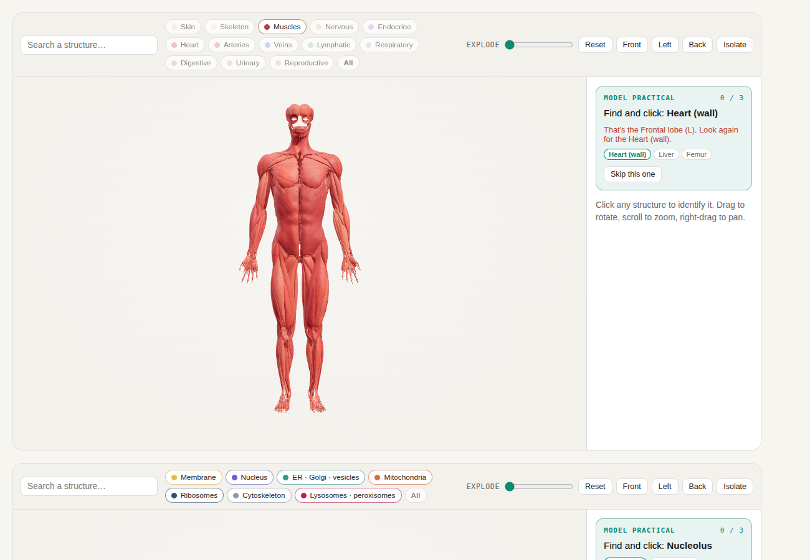
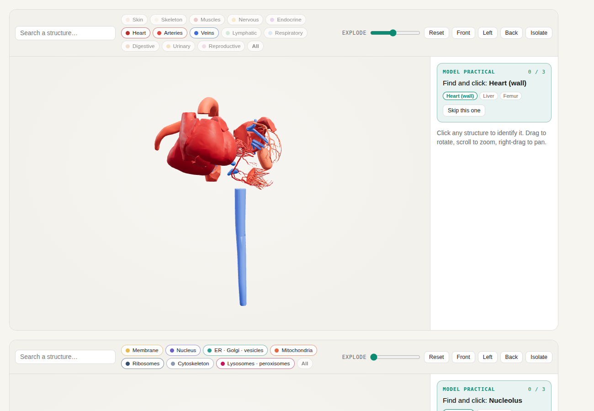
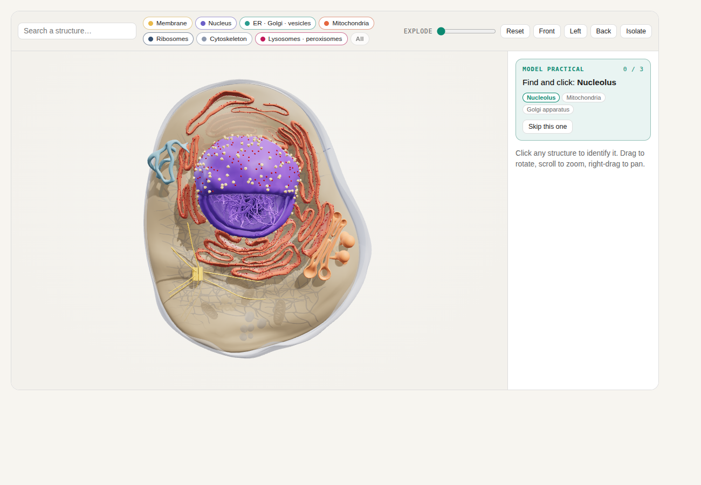
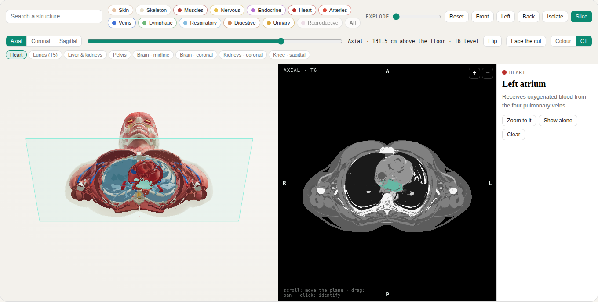
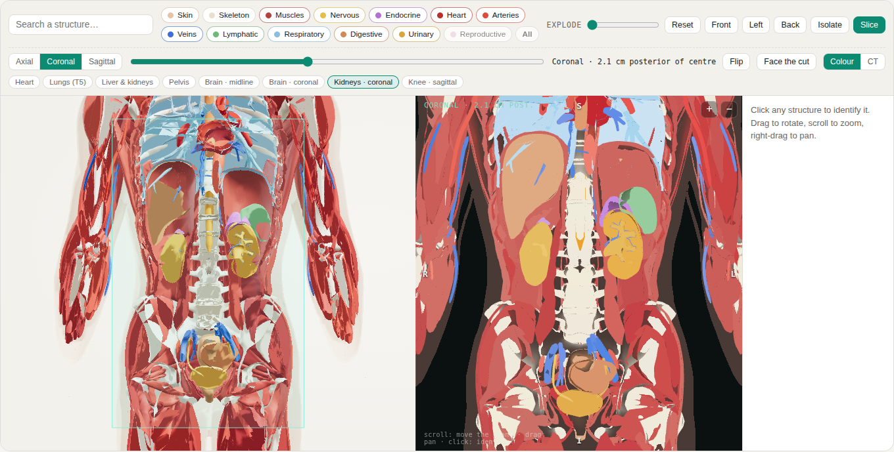
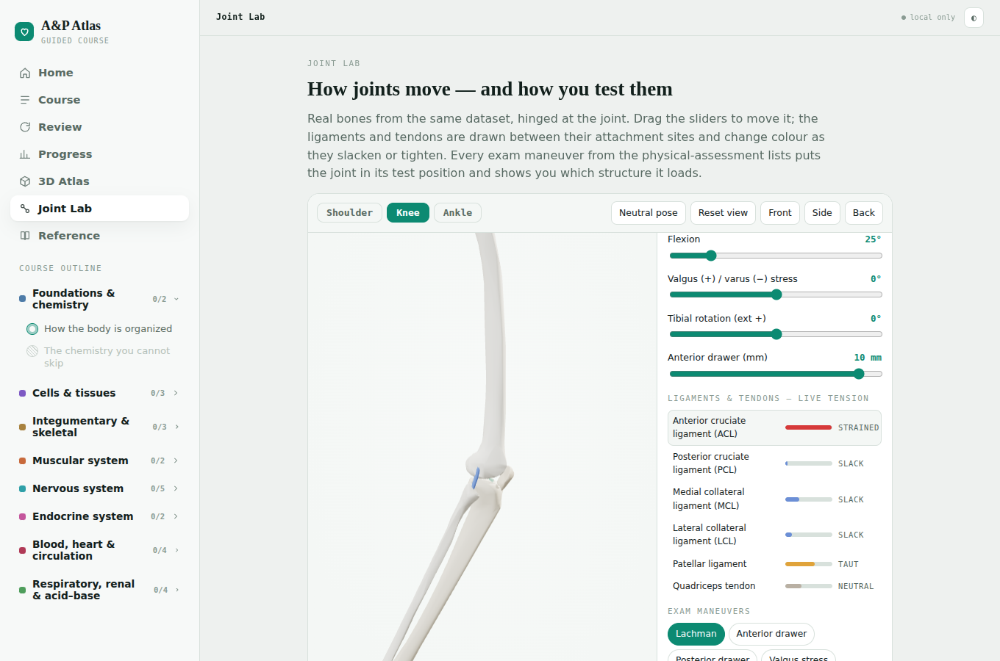
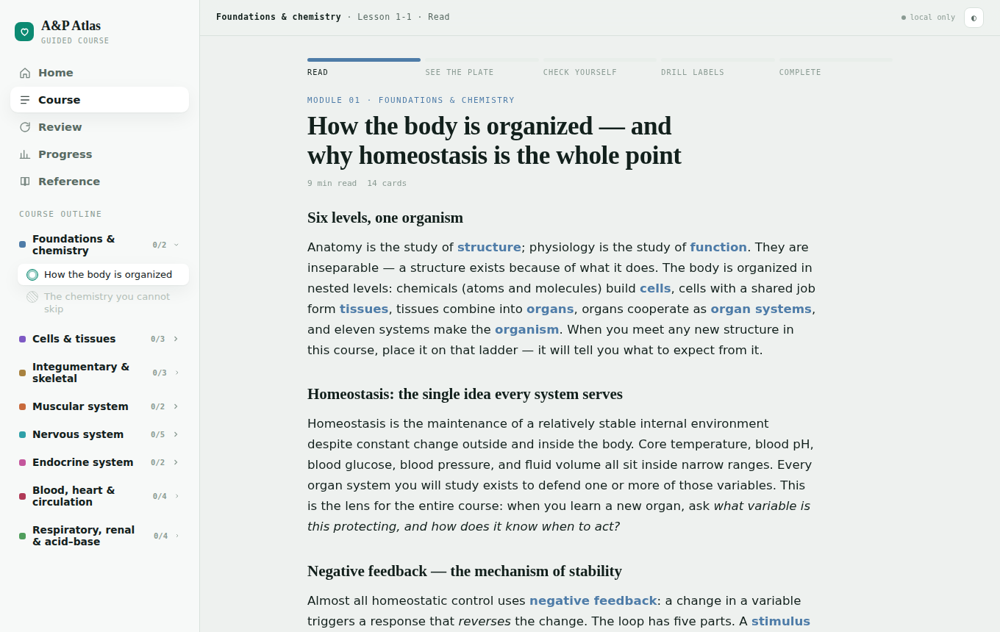
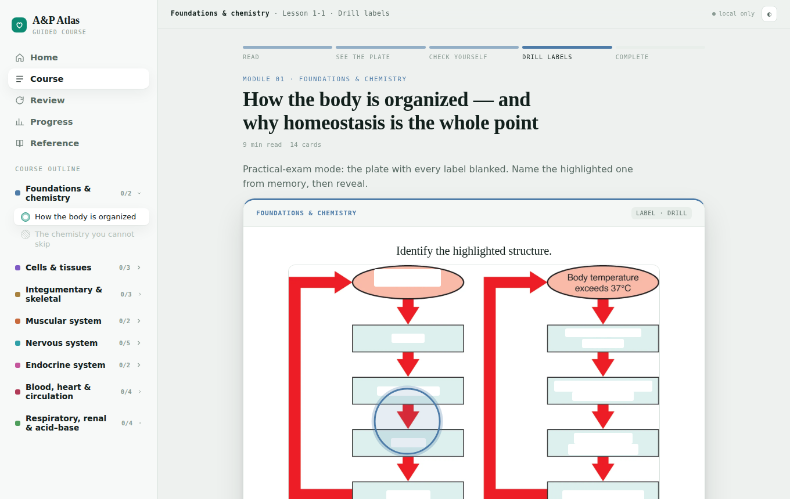
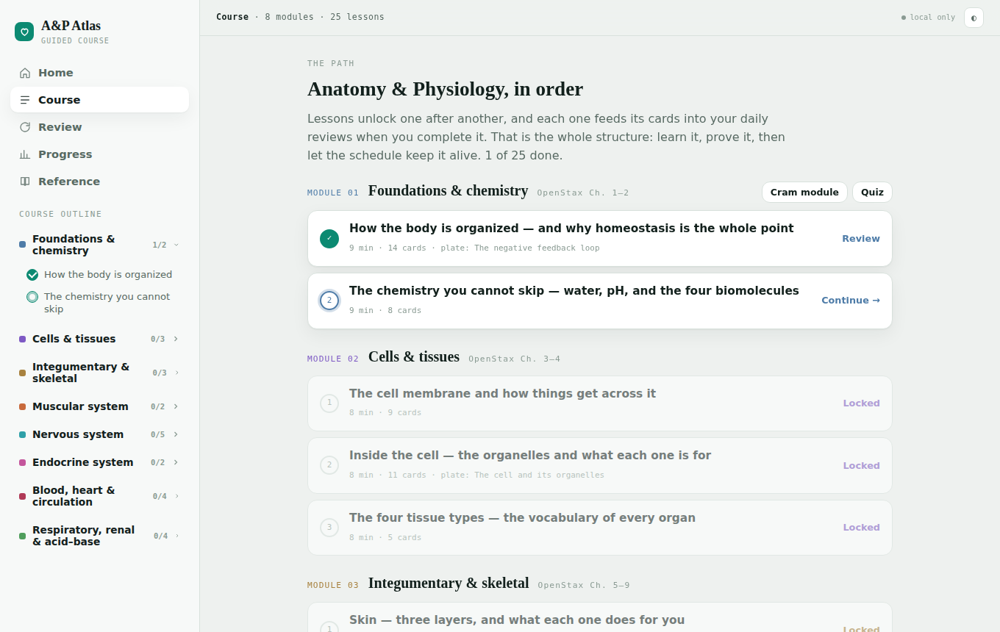

# A&P Atlas

**A free, open, guided anatomy & physiology course with a real 3D body you can click, explode and slice like a CT, a real 3D cell and a joint lab — plain HTML, no build, no server.**

Built for nursing prereqs. No account, no server, no tracking: everything runs in your browser and your progress stays on your device.

  

## What's inside

**A guided course, not a pile of flashcards.** 8 modules → 25 lessons that unlock one after another. Every lesson runs the same way:

1. **Read** — an in-depth lesson with key terms and a "why this matters at the bedside" note
2. **See the plate** — the real OpenStax *Anatomy & Physiology 2e* figure
3. **Explore in 3D** — the model set up for that lesson, with a *model practical*: find and click the structures on the list
4. **Check yourself** — a 5-question check (70% to pass)
5. **Drill labels** — the plate with every label blanked, practical-exam style
6. **Complete** — the lesson's cards enter your daily spaced-repetition reviews

**A real 3D body.** 401 curated structures from [BodyParts3D](https://dbarchive.biosciencedbc.jp/en/bodyparts3d/) (MRI-derived, not drawn): the full skeleton, ~70 named muscles, brain lobes and deep structures, brainstem and spinal cord, heart wall, chambers, valves and coronaries, major arteries and veins down to the pedal pulses, lungs and airway, kidneys and urinary tract, GI tract and glands. Click anything to identify it, layer systems on and off, explode it, search it.

**Cross-sections.** Cut the body on any axial, coronal or sagittal plane. The 3D view is capped at the cut; a second panel shows the slice in radiological orientation (patient's right on your left, anterior at the top) in colour or as a CT-style grey-scale, with the vertebral level read off the spine. Scroll to move the plane, click anything in the slice to name it. Presets for the heart, lungs, upper abdomen, pelvis, brain (midline and coronal), kidneys and knee.

**A real 3D cell.** A cross-section model with 18 clickable organelles for the cell lessons.

**A joint lab.** Shoulder, knee and ankle hinged on the real bones: motion sliders, ligaments and tendons drawn between their attachment sites with live tension, and the named exam maneuvers (Lachman, anterior drawer, empty can, apprehension, talar tilt, Thompson…) that put the joint in its test position and show which structure it loads.

**Retention built in.** SM-2 spaced repetition (252 cards), streaks, a review forecast, mastery by module, cram and quiz modes.

| | | |
|---|---|---|
|  |  |  |
|  |  |  |
|  |  |  |

## Use it

**Hosted:** https://apatlasdev.github.io/ap-atlas/ — or clone the repo and open `index.html` (serve the folder locally, e.g. `python -m http.server`, so the browser can load the data files).

Progress is saved in your browser's local storage; use the same browser to keep your streak. Chrome, Edge, Safari 16.4+ and Firefox 113+ are supported (the 3D models use the browser's built-in gzip decoder).

## How it's built

There is no framework and no build step. Plain files:

- `index.html` — the page shell and all CSS
- `app.js` — the course: lessons, cards, scheduler, sessions and every view (assembled from `src/course/`)
- `vendor/atlas3d.js` — the 3D viewer, slice mode and joint lab (Three.js r147 in `vendor/three.min.js`)
- `data/figures.js` — the OpenStax plates plus their label masks, base64
- `data/body.js`, `data/cell.js` — the packed 3D models (quantized, gzipped, base64)
- `src/` — the readable sources and the Python pipeline that curates, decimates, quantizes and packs the anatomy (`atlas3d/config.py`, `build.py`) and the cell (`cellbuild.py`)

The 3D pipeline reads the BodyParts3D OBJ/STL set, merges the sub-meshes of each structure, simplifies each one to a triangle budget, quantizes positions to 16-bit, and gzips the result; the viewer inflates it with `DecompressionStream` and renders each structure as its own mesh with GPU picking for click-to-identify. Slice mode is a clipping plane with the cut faces shaded as flat caps, plus an orthographic camera sitting on the plane: because every structure is a closed surface, any back-face visible from the plane is solid tissue, so each structure's cross-section fills itself; a single stencil pass over the skin supplies the soft-tissue silhouette, and the CT look is just a grey per tissue class.

## Data & attribution

- **Anatomy:** BodyParts3D, © The Database Center for Life Science, licensed under [CC BY 4.0](https://creativecommons.org/licenses/by/4.0/). Adult male reference anatomy; geometry simplified for the browser.
- **Cell:** *Eukaryotic Cell Cross Section* by [dav169](https://sketchfab.com/dav169) on Sketchfab, [CC BY 4.0](https://creativecommons.org/licenses/by/4.0/). Simplified and recolored per organelle.
- **Plates:** OpenStax, *Anatomy and Physiology 2e* (Rice University), [CC BY 4.0](https://creativecommons.org/licenses/by/4.0/).
- **Three.js** (MIT).

See [ATTRIBUTION.md](ATTRIBUTION.md) for details. Lesson text, cards, schematics and code are original to this project.

This is a study tool for students. It is not a clinical reference.

## License

Code: [MIT](LICENSE). Lesson content: CC BY 4.0. Third-party data as listed above.
